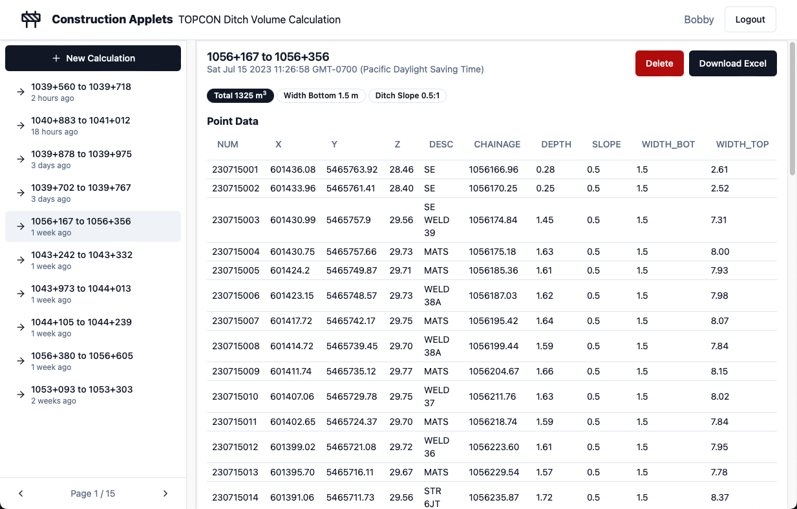

## Problem

Over the couple years that I've worked in the construction industry I have developed several robust Python libraries for making various niche tasks much, much, faster. One of these libraries is my Chainage Finding Algorithm, which I've used to make my [Photo Renamer](https://rileypaul.ca/projects/chainage-photo-renamer/).

These various libraries, scripts and functions I've created have benefitted my productivity greatly! They've allowed me to do things way more efficiently than with conventional tooling.

The problem is that my coworkers are unable to run my scripts without replicating my Python environment on their machines and knowing how to operate a CLI. This means that I am regularly sent emails asking me to run one script or another on a piece of data or attached file.

Not only is this an inefficient use of my time, but a waste of time for my coworkers. They have to send an email then wait for my response. If their data is wrong they won't know until they get my email response.

## Solution

I decided to take matters into my own hand by building out a full-stack web application that places a lovely, modern, GUI between the user and some of my most-loved scripts. This allows my coworkers to perform the calculations they need, when they need them, and not feel guilty about always bugging me.

## Implementation

As I'm a huge fan of the file-based routing, non-virtual DOM, built-in stores, and HTML-like syntax of SvelteKit, it was an obvious choice for the front-end framework. I chose to use Postgres for the database as the flexibility of NoSQL feels overwhelming at times. FastAPI is used on the backend for the calculation server hosting all the Python scripts, though I hope to move those to serverless functions going forward.

**Frontend |** SvelteKit w/ Shadcn UI Components

**Backend |** Python FastAPI, PostgreSQL, Prisma ORM

## Lessons

I learned a ton about SvelteKit on this project as I hadn't used it much prior to this. I love how simple it is to run code on either the client or server.

Sending files through HTTP forms was also a massive learning curve for this project. In the end I found it quite intuitive but it definitely took some figuring.

## Plans

I would like to continue to add more scripts to the application to build out the functionality.

---

## _Update Jul 2023_

I implemented pagination for data fetching because the serverless functions were timing out when trying to fetch excessive amounts of entities.

I rewrote my chainage algorithm in typescript so it can be used in a Node environment. This will become very useful for future plans I have.

I replaced the Skeleton UI components with [Shadcn](https://www.shadcn-svelte.com) components because the look is much cleaner and they are easier to work with.
