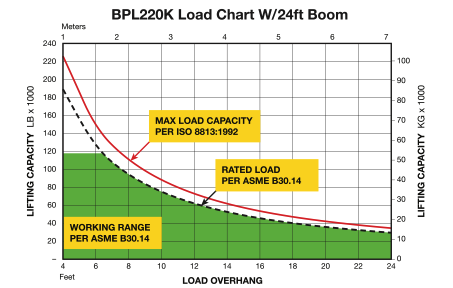
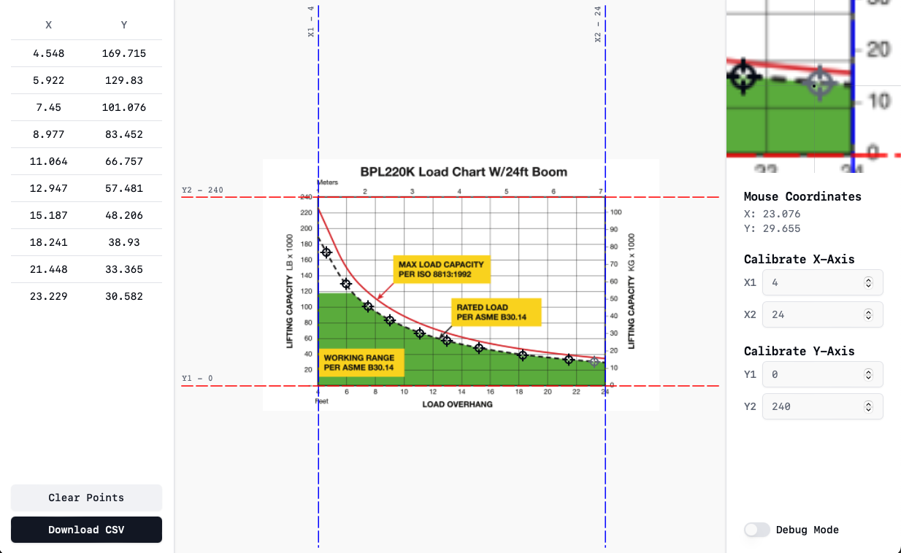

## Introduction

Have you ever needed to convert data from a graphical format and found yourself painstakingly entering data in a spreadsheet while zooming in and out on the plot image?

This web app allows users to upload an image of a plot, calibrate an x and y scale, drop as many points as they would like on it, then export those points to CSV with accurate coordinates.

## How it Works

There are many instances where data is available in only a chart format with an x and y axis and minimal labels. The below is a prime example of this.

This app allows users to import an image, calibrate the image, then place as many points as they would like and export those to a CSV file. Currently the tool is only able to be calibrated for linear plots.

## How I Built It

This single-page React application is written in Typescript and hosted on GitHub Pages. I tried to use as few libraries as possible and work directly with native web technologies such as canvas and form elements.

I used the [Shadcn](https://ui.shadcn.com) UI component library to enhance the overall fit and finish.

I implemented my own version of the [Quadtree Optimization](https://en.wikipedia.org/wiki/Quadtree) algorithm to efficiently determine which point the cursor is hovering over in the canvas.

## Future Plans

In the future I would consider adding options for different axis scales such as logarithmic and datetime.
