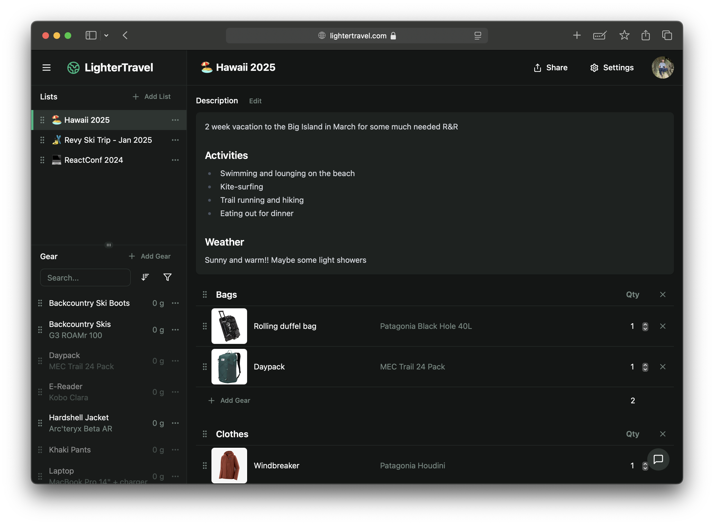

## Inspiration

I often embark on gear-intensive backcountry adventures and to ensure everything goes smoothly, I rely on detailed packing lists.

The most popular tool for this is LighterPack, which has a great drag-and-drop interface and a useful visualization system to show which items in your pack contribute most to the overall weight.

However, while LighterPack works fairly well on desktop, it’s not ideal for mobile. There are also additional features I’ve wanted but didn’t find in the tool. After reaching out to the creator multiple times with no response, I decided to build my own version.

## Technology

I built this app using Astro, a full-stack JavaScript framework. Most pages, such as login, shared lists, and terms of service, are server-rendered.

Given the app's highly responsive nature, where nearly every interaction updates the database, I developed the main application as a single-page React app. This ensures a smooth, reload-free user experience. I used Tanstack Query for server-client state synchronization, and backend server actions to maintain end-to-end type safety.

For simplicity, I opted for Astro DB, a hosted LibSQL database provided by the framework’s creators.

## Future Plans

I’m currently focusing on marketing and gathering user feedback. One common suggestion is to add a guest user login option, as people are hesitant to share their email addresses upfront.
