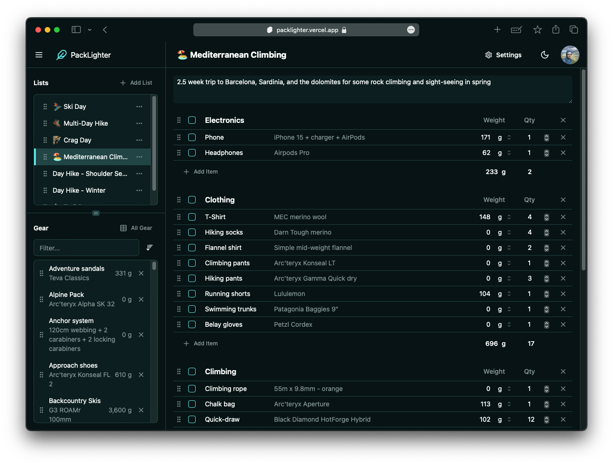

## Inspiration

I got on a lot of gear-intensive backcountry adventures. To ensure everything goes as smoothly as possible, I like to make pretty extensive packing lists.

The current most popular tool for this is [LighterPack](https://lighterpack.com). It has a fantastic drag and drop interface and a great visualization system for determining which items in your pack are contributing the most to the overall weight.

The issue is that while LighterPack works fairly well on the desktop for the most part, it is a non-starter on mobile. There are also some additional features I would like to see added. I emailed the creator several times to offer my help but recieved no response. So I decided to create a version for myself.

## Technology

As this is a highly responsive interface, with a database update needed for pretty much every interaction, I chose to create a single-page React application for the frontend. This means the user experiences no full page reloads and everything is as seemless as possible.
