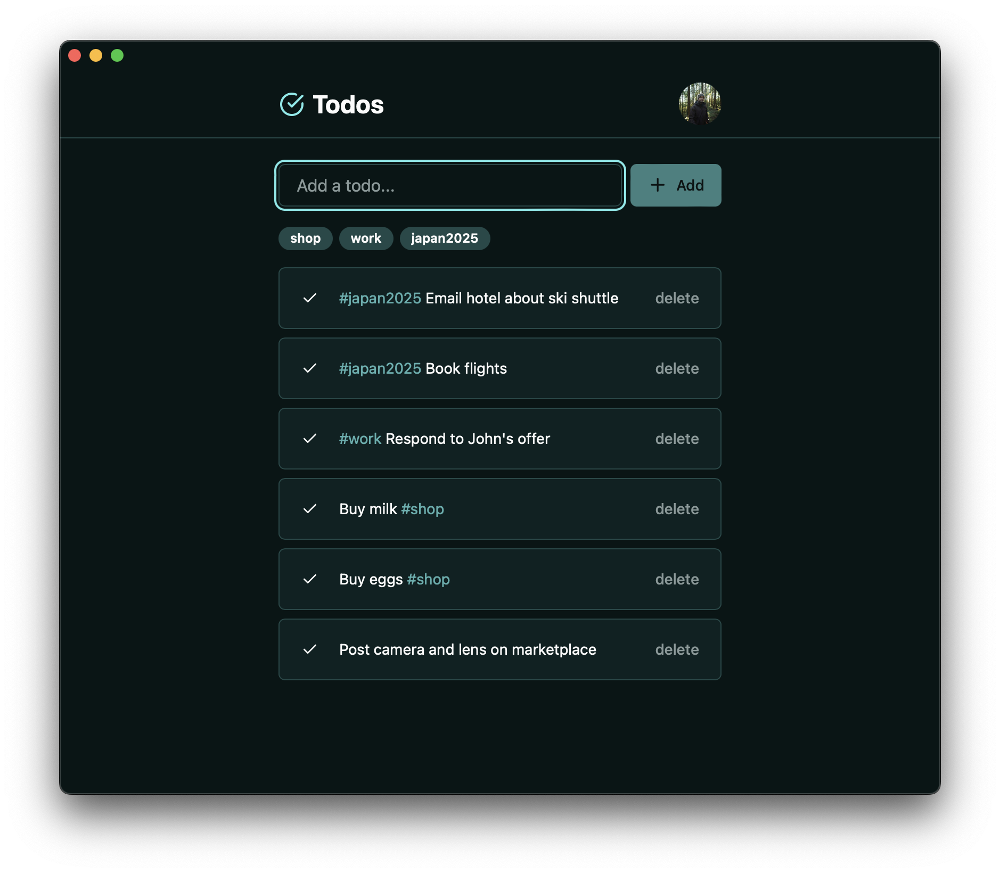

This has got to be the least interesting project a person can make, but it does make for a great testing ground for learning new technologies and techniques.

## Technology

- Astro JS web framework
- OAuth2 authentication
- Hono backend (embedded in Astro)
- React single-page-application frontend (embedded in Astro)
- Astro DB database

## Interesting Architecture

It may seem counterintuitive to embed a self-contained backend, and a self-contained SPA in a server-rendering framework. The benefits of this architecture are as follows:

### Embedded Backend

Hono is a much more powerful backend framework than Astro with a rich ecosystem of middlewares and validators. The non-file-based routing allows for a much cleaner project structure.

### Embedded Frontend

With React-Query and client-side routers, the single-page application experience is still much snappier and closer to native apps than the server-rendered paradigm that is making a comeback; especially when making heavy use of optomistic updates.

### Optional Server-Rendering

The app can still be extended by as many server rendered pages as is necessary.

### Pain-Free Configuring and Bundling

Astro is made by people much more knowledgeable than myself on the dark arts of bundling and configuring. Rather than try to build both my frontend and backend and frontend separately and keep their deployments in sync, it is easier to just let Astro do it's thing and build my app for whichever platform I decide to deploy it on.

## OAuth

This was my first project that I feel confident in my implementation of the OAuth2 authentication method. I'm offering login with either Github or Google and using the excellent Lucia suite of utilities.
