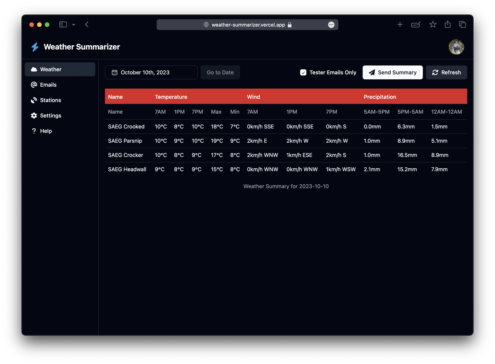

## Background

While working on a remote construction project in Northern BC in 2020, adverse weather events such as torrential rain and extreme cold caused substantial budget and schedule overages. As I was working for the contractor, they had to justify these overages to the client but struggled to do so do to the limited coverage of public weather stations in the remote area.

## Solution

I implemented a constellation of five internet-connected weather stations along with a Raspberry Pi server to record the weather along the construction project and produce a daily report. This report was distributed to upper management to inform them on their decisions for the day.

## Implementation

The weather stations are connected to [Weather Underground](https://www.wunderground.com/) for live data display and storage.

Function run as a CRON job for fetching weather data from the Weather Underground API, summarizing that data using Pandas and distributing it using the Gmail API.

In 2023 I rewrite the codebase in Typscript to take advantage of the strong typing and the excellent Handlbar HTML templating engine. This allowed me to make the script substantially more robust and greatly reduce the frequency of errors.

## Outcome

As a result of this substantially more detail weather record, my employer was able to get multi-million dollar change order requests approved. Additionally, the dailt weather report has been instrumental in planning workfronts to avoid causing environmental damage.

---

## Update - Jul 2022

In 2022 the Pi stopped working so I deployed the codebase to a linux server hosted by [Linode](https://linode.com).

---

## Update - Sep 2023

I built out a complete frontend and database for the project. The weather information is cached in the database to reduce the calls to the Weather Underground API. The frontend allows users to add and remove weather stations, update the Weather Underground API key, add and remove people from the email list, and view weather from any date in the past, as well as re-send the email from that date.

The front and backend were built using the Astro web framework and deployed to the Vercel serverless runtime. I used Upstash to schedule an endpoint hit every hour so the emails would be sent on time. This was necessary because the temporary nature of serverless functions precluded scheduling system cronjobs.
